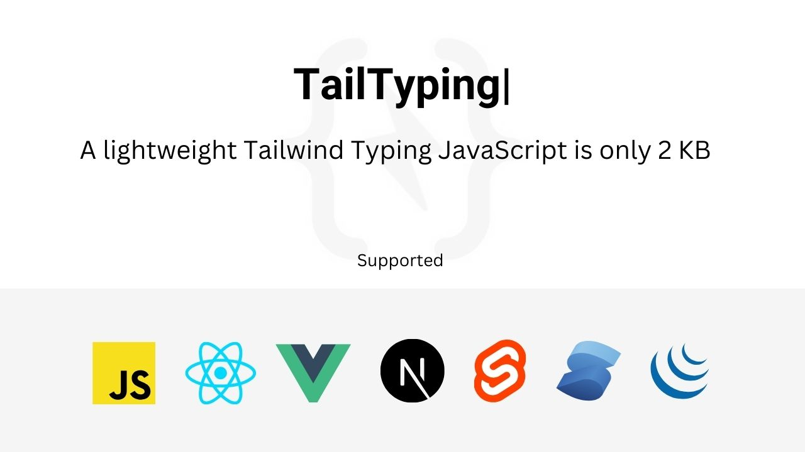

# TailTyping - Tailwind Typing for JavaScript

The lightweight Tailwind Typing for JavaScript is only 2KB in size and less than 1KB Compressed, providing stunning typing effects without burdening your website with overhead. Tailtyping uses the MIT license so you can use it including in commercial projects. Credit to the Github page is always appreciated. Development by [@ari_budin](https://twitter.com/ari_budin)

## Demo Preview

Demo: [https://aribudin.github.io/tailtyping/](https://aribudin.github.io/tailtyping/)

## Installation Starter Project

* Clone the repository with the following command:

```
git clone https://github.com/aribudin/tailtyping.git
```
* Run in terminal this command:

```
npm install
```
```
npm run dev
```
* Open .html file in your browser and start development

## Download file

Download .zip file [in here](https://github.com/aribudin/tailtyping/releases)
                    
## How To Use ?

We provide examples of html and vanilla javascript functions for tailtyping components.

Put the script in the last line before close body
```
<script src="src/js/tailtyping.js"></script>
```

Next, you'll need to create HTML elements where you want to apply the typing effect:
```
<!-- Default -->
<p data-typing="true">I'm also a <span data-text="Developer|Creator|Designer"></span></p>

<!-- With data-options -->
<p data-typing="true" data-options='{"typeSpeed": 200, "eraseSpeed": 100, "typeWait": 2000, "eraseWait": 1000}'>Hello, I am a <span data-text="Developer|Creator|Designer"></span></p>

<!-- With custom css -->
<h1 data-typing="true" class="mb-6 text-3xl font-bold leading-snug sm:text-4xl sm:leading-snug md:text-[45px] md:leading-snug [&_.typing-cursor]:text-red-600">
  Magic Typing for <span class="relative" data-text="Developer|Personal|Freelancer">Developer<span class="typing-cursor"></span></span>
</h1>
                  
```

**Information**

Type  | description  
------------- | ------------- 
data-typing="true"  | Trigger typing function  
data-options=''  | Options for speed, erase and wait  
data-text=""  | Data typing text  

## PRO VERSION

[TailTyping All Version](https://tailnet.gumroad.com/l/tailtyping)

## About LightestCode

"LightestCode is a JavaScript code project that focuses on creating additional features for websites using simple and small-sized code. Based on our experience as website developers, there are times when we want to add specific features to the websites we create by incorporating plugins/vendors/libraries, but sometimes the size of the plugins we use can be quite large. It is from this experience that we develop features with basic JavaScript functions that are small in size, ensuring they do not impact the performance and loading of your website."
